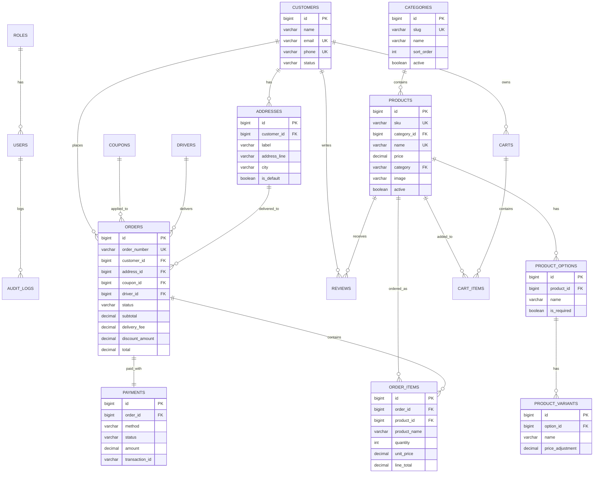
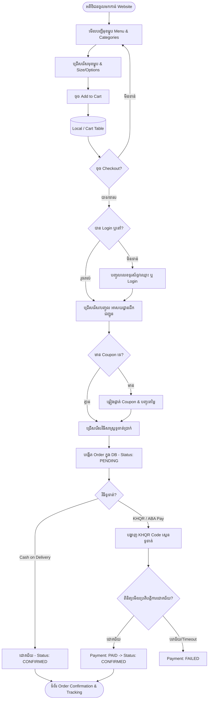
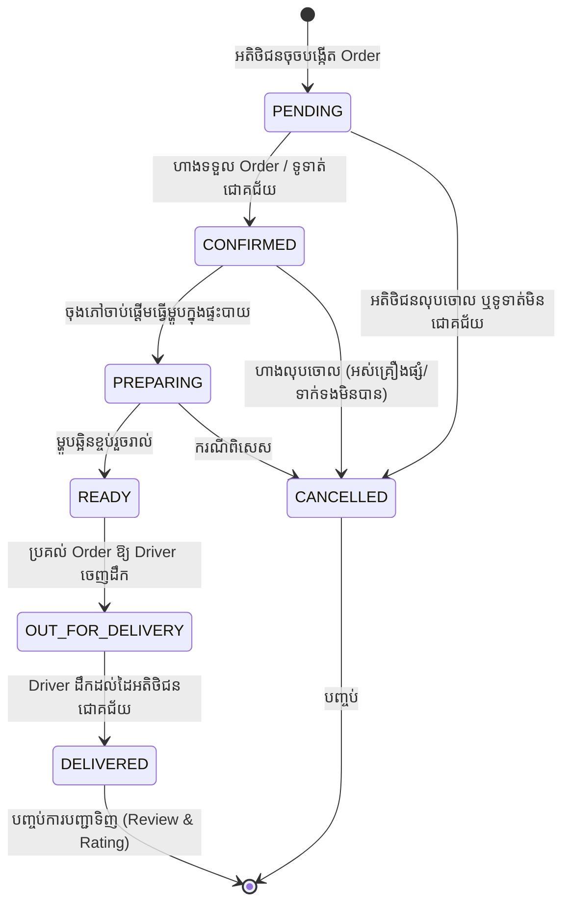
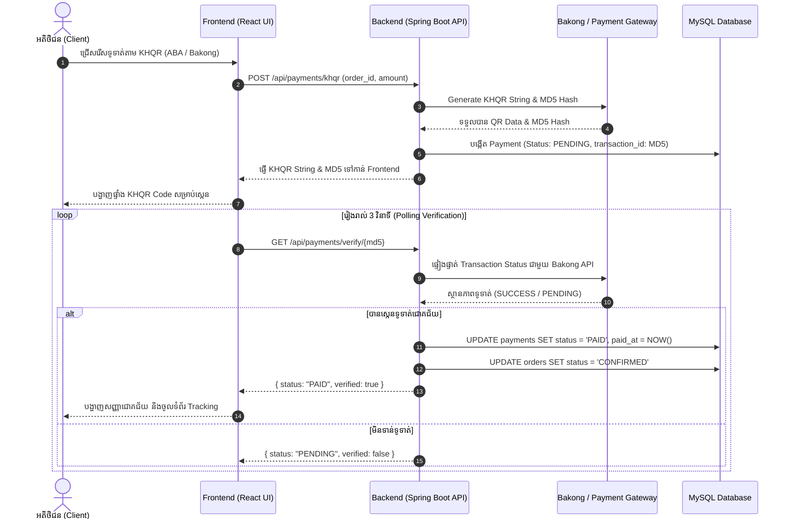

# 🍕 Flame & Crust — Database Structure & Flowchart Documentation

ឯកសារនេះរៀបរាប់អំពី **ឈ្មោះតារាង (Table Names)** ទាំងអស់នៅក្នុង Database, **រចនាសម្ព័ន្ធតារាង (Schema & Structure)**, **ដ្យាក្រាមទំនាក់ទំនង (ER Diagram)** និង **ដ្យាក្រាមដំណើរការ (Business Flowcharts)** នៃគម្រោង Flame & Crust Pizza។

---

## 📑 តារាងមាតិកា (Table of Contents)
1. [បញ្ជីឈ្មោះតារាងទាំងអស់ (All 18 Tables)](#1-បញ្ជីឈ្មោះតារាងទាំងអស់-all-18-tables)
2. [ER Diagram — ទំនាក់ទំនងរវាង Tables (Entity-Relationship Diagram)](#2-er-diagram--ទំនាក់ទំនងរវាង-tables)
3. [រចនាសម្ព័ន្ធលម្អិតនៃតារាងនីមួយៗ (Detailed Table Structures)](#3-រចនាសម្ព័ន្ធលម្អិតនៃតារាងនីមួយៗ-detailed-table-structures)
   - [3.1 User & Authentication (ការគ្រប់គ្រងអ្នកប្រើប្រាស់)](#31-user--authentication)
   - [3.2 Menu & Catalog (បញ្ជីមុខម្ហូប)](#32-menu--catalog)
   - [3.3 Customer & Address (អតិថិជន និងអាសយដ្ឋាន)](#33-customer--address)
   - [3.4 Cart & Discount (កន្ត្រក និងប័ណ្ណបញ្ចុះតម្លៃ)](#34-cart--discount)
   - [3.5 Order & Payment (ការកុម្ម៉ង់ និងការទូទាត់)](#35-order--payment)
   - [3.6 Delivery, Security & Logs (ការដឹកជញ្ជូន និងសុវត្ថិភាព)](#36-delivery-security--logs)
4. [ដ្យាក្រាមដំណើរការទិន្នន័យ (Business Flowcharts)](#4-ដ្យាក្រាមដំណើរការទិន្នន័យ-business-flowcharts)
   - [4.1 Customer Ordering & Checkout Flow](#41-customer-ordering--checkout-flow)
   - [4.2 Order Lifecycle & Status Flow](#42-order-lifecycle--status-flow)
   - [4.3 Payment & KHQR Verification Flow](#43-payment--khqr-verification-flow)

---

## 1. បញ្ជីឈ្មោះតារាងទាំងអស់ (All 18 Tables)

| ល.រ (No.) | ឈ្មោះតារាង (Table Name) | ប្រភេទក្រុម (Module / Category) | ការពិពណ៌នា (Description) |
| :---: | :--- | :--- | :--- |
| **1** | `roles` | User & Access | តួនាទីបុគ្គលិក (Admin, Manager, Staff) និង Permissions (JSON) |
| **2** | `users` | User & Access | គណនីបុគ្គលិកសម្រាប់ Login ចូល Admin Dashboard |
| **3** | `customers` | Customer Management | គណនីអតិថិជន (Email, Phone, Password) សម្រាប់បញ្ជាទិញ |
| **4** | `addresses` | Customer Management | អាសយដ្ឋានដឹកជញ្ជូនរបស់អតិថិជន (Customer Addresses) |
| **5** | `categories` | Catalog & Menu | ប្រភេទមុខម្ហូប (Pizza, Pizza Bagels, Burgers, Sides, Drinks) |
| **6** | `products` | Catalog & Menu | ទំនិញ/មុខម្ហូប (ឈ្មោះ, តម្លៃ, រូបភាព, Rating, Description) |
| **7** | `product_options` | Catalog & Menu | ជម្រើសបន្ថែមរបស់ម្ហូប (Options ដូចជា Size, Crust Type) |
| **8** | `product_variants` | Catalog & Menu | តម្លៃបូកបន្ថែមនៃ Option នីមួយៗ (Variants & Price Adjustment) |
| **9** | `reviews` | Feedback & Rating | ការវាយតម្លៃ និងមតិយោបល់របស់អតិថិជនលើផលិតផល |
| **10** | `carts` | Shopping Cart | កន្ត្រកទំនិញរបស់អតិថិជនម្នាក់ៗ |
| **11** | `cart_items` | Shopping Cart | មុខម្ហូប និងចំនួនដែលដាក់ក្នុងកន្ត្រក |
| **12** | `coupons` | Promotions | ប័ណ្ណបញ្ចុះតម្លៃ (Code, Percentage / Fixed Discount) |
| **13** | `orders` | Order Processing | ប័ណ្ណកុម្ម៉ង់ទិញសរុប (Customer, Address, Coupon, Status, Total) |
| **14** | `order_items` | Order Processing | មុខម្ហូបនីមួយៗនៅក្នុង Order (Quantity, Unit Price, Total) |
| **15** | `payments` | Payment & Finance | ប្រតិបត្តិការទូទាត់ប្រាក់ (CASH, ABA KHQR, WING, CARD) |
| **16** | `drivers` | Logistics & Delivery | ព័ត៌មានអ្នកដឹកជញ្ជូន (Driver Name, Phone, Vehicle, Status) |
| **17** | `otps` | Security | កូដ OTP សម្រាប់ផ្ទៀងផ្ទាត់លេខទូរស័ព្ទ ឬអ៊ីមែល |
| **18** | `audit_logs` | System Security | ប្រវត្តិការកែប្រែទិន្នន័យរបស់ Admin/Staff ក្នុងប្រព័ន្ធ |

---

## 2. ER Diagram — ទំនាក់ទំនងរវាង Tables

---

## 3. រចនាសម្ព័ន្ធលម្អិតនៃតារាងនីមួយៗ (Detailed Table Structures)

### 3.1 User & Authentication

#### 1. `roles` (តួនាទីបុគ្គលិក)
| Column Name | Data Type | Constraints | Description |
| :--- | :--- | :--- | :--- |
| `id` | BIGINT | PRIMARY KEY, AUTO_INCREMENT | លេខសម្គាល់ Role |
| `name` | VARCHAR(50) | NOT NULL, UNIQUE | ឈ្មោះតួនាទី (Admin, Manager, Staff) |
| `permissions` | JSON | NOT NULL | សិទ្ធិក្នុងការបញ្ជាប្រព័ន្ធជាទម្រង់ JSON |

#### 2. `users` (គណនី Admin / Staff)
| Column Name | Data Type | Constraints | Description |
| :--- | :--- | :--- | :--- |
| `id` | BIGINT | PRIMARY KEY, AUTO_INCREMENT | លេខសម្គាល់ User |
| `role_id` | BIGINT | NOT NULL, FK -> `roles(id)` | ភ្ជាប់ទៅកាន់តួនាទី |
| `name` | VARCHAR(120) | NOT NULL | ឈ្មោះបុគ្គលិក |
| `email` | VARCHAR(180) | NOT NULL, UNIQUE | អ៊ីមែលសម្រាប់ Login |
| `password_hash` | VARCHAR(255) | NOT NULL | ពាក្យសម្ងាត់ដែលបាន Hash (BCrypt) |
| `status` | VARCHAR(20) | NOT NULL, DEFAULT 'ACTIVE' | ស្ថានភាព (`ACTIVE`, `SUSPENDED`) |
| `created_at` | TIMESTAMP | NOT NULL, DEFAULT CURRENT_TIMESTAMP | ថ្ងៃបង្កើតគណនី |
| `deleted_at` | TIMESTAMP | NULL | ថ្ងៃលុបគណនី (Soft Delete) |

---

### 3.2 Menu & Catalog

#### 3. `categories` (ប្រភេទមុខម្ហូប)
| Column Name | Data Type | Constraints | Description |
| :--- | :--- | :--- | :--- |
| `id` | BIGINT | PRIMARY KEY, AUTO_INCREMENT | លេខសម្គាល់ Category |
| `slug` | VARCHAR(50) | NOT NULL, UNIQUE | ឈ្មោះកូដតំណរភ្ជាប់ (pizza, drink, burgers) |
| `name` | VARCHAR(100) | NOT NULL | ឈ្មោះប្រភេទមុខម្ហូប (Pizza, Drink...) |
| `sort_order` | INT | NOT NULL, DEFAULT 0, CHECK >= 0 | លំដាប់បង្ហាញនៅលើ Menu |
| `active` | BOOLEAN | NOT NULL, DEFAULT TRUE | បង្ហាញ ឬលាក់នៅលើ Storefront |

#### 4. `products` (មុខម្ហូប / ទំនិញ)
| Column Name | Data Type | Constraints | Description |
| :--- | :--- | :--- | :--- |
| `id` | BIGINT | PRIMARY KEY, AUTO_INCREMENT | លេខសម្គាល់ផលិតផល |
| `sku` | VARCHAR(40) | NULL, UNIQUE | លេខកូដទំនិញ SKU |
| `category_id` | BIGINT | NULL, FK -> `categories(id)` | ភ្ជាប់ទៅកាន់ Category ID |
| `name` | VARCHAR(150) | NOT NULL, UNIQUE | ឈ្មោះមុខម្ហូប |
| `description` | TEXT | NOT NULL | ការពិពណ៌នាពីគ្រឿងផ្សំ/រសជាតិ |
| `price` | DECIMAL(10,2) | NOT NULL, CHECK >= 0 | តម្លៃលក់ |
| `base_price` | DECIMAL(10,2) | NULL | តម្លៃដើម |
| `category` | VARCHAR(50) | NOT NULL, FK -> `categories(slug)` | Slug របស់ Category |
| `image` | VARCHAR(255) | NOT NULL | URL រូបភាព ឬផ្លូវ Cloudinary |
| `tags` | VARCHAR(255) | NOT NULL, DEFAULT '' | ស្លាកចំណាំ (Bestseller, Spicy...) |
| `rating` | DECIMAL(2,1) | NOT NULL, DEFAULT 0.0, CHECK (0-5) | ពិន្ទុផ្កាយវាយតម្លៃ |
| `popular` | BOOLEAN | NOT NULL, DEFAULT FALSE | ទំនិញលក់ដាច់ / ពេញនិយម |
| `spicy` | BOOLEAN | NOT NULL, DEFAULT FALSE | មានរសជាតិហឹរ |
| `vegetarian` | BOOLEAN | NOT NULL, DEFAULT FALSE | ម្ហូបបួស |
| `active` | BOOLEAN | NOT NULL, DEFAULT TRUE | បង្ហាញ ឬផ្អាកលក់ |
| `created_at` | TIMESTAMP | NOT NULL, DEFAULT CURRENT_TIMESTAMP | ថ្ងៃបញ្ចូលទំនិញ |
| `updated_at` | TIMESTAMP | NOT NULL, DEFAULT CURRENT_TIMESTAMP ON UPDATE | ថ្ងៃកែប្រែទំនិញចុងក្រោយ |

#### 5. `product_options` (ជម្រើសបន្ថែមរបស់ម្ហូប)
| Column Name | Data Type | Constraints | Description |
| :--- | :--- | :--- | :--- |
| `id` | BIGINT | PRIMARY KEY, AUTO_INCREMENT | លេខសម្គាល់ Option |
| `product_id` | BIGINT | NOT NULL, FK -> `products(id)` ON DELETE CASCADE | ភ្ជាប់ទៅកាន់ Product |
| `name` | VARCHAR(50) | NOT NULL | ឈ្មោះ Option (ឧ. Size, Crust, Spice Level) |
| `is_required` | BOOLEAN | NOT NULL, DEFAULT FALSE | តម្រូវឱ្យជ្រើសរើសជាចាំបាច់ឬអត់ |

#### 6. `product_variants` (តម្លៃ និងជម្រើសលម្អិត)
| Column Name | Data Type | Constraints | Description |
| :--- | :--- | :--- | :--- |
| `id` | BIGINT | PRIMARY KEY, AUTO_INCREMENT | លេខសម្គាល់ Variant |
| `option_id` | BIGINT | NOT NULL, FK -> `product_options(id)` ON DELETE CASCADE | ភ្ជាប់ទៅកាន់ Product Option |
| `name` | VARCHAR(50) | NOT NULL | ឈ្មោះជម្រើស (Large, Stuffed Crust, Mild) |
| `price_adjustment`| DECIMAL(10,2) | NOT NULL, DEFAULT 0.00 | តម្លៃបន្ថែម (+$2.00) |
| `active` | BOOLEAN | NOT NULL, DEFAULT TRUE | បើកឱ្យជ្រើសរើស |

#### 7. `reviews` (ការវាយតម្លៃរបស់អតិថិជន)
| Column Name | Data Type | Constraints | Description |
| :--- | :--- | :--- | :--- |
| `id` | BIGINT | PRIMARY KEY, AUTO_INCREMENT | លេខសម្គាល់ Review |
| `product_id` | BIGINT | NOT NULL, FK -> `products(id)` ON DELETE CASCADE | ផលិតផលដែលត្រូវបាន Review |
| `customer_id` | BIGINT | NOT NULL, FK -> `customers(id)` ON DELETE CASCADE | អតិថិជនដែលបាន Review |
| `rating` | INT | NOT NULL, CHECK (1-5) | ចំនួនផ្កាយ (១ ដល់ ៥) |
| `comment` | TEXT | NULL | មតិយោបល់ |
| `created_at` | TIMESTAMP | NOT NULL, DEFAULT CURRENT_TIMESTAMP | ថ្ងៃ Review |

---

### 3.3 Customer & Address

#### 8. `customers` (គណនីអតិថិជន)
| Column Name | Data Type | Constraints | Description |
| :--- | :--- | :--- | :--- |
| `id` | BIGINT | PRIMARY KEY, AUTO_INCREMENT | លេខសម្គាល់ Customer |
| `name` | VARCHAR(120) | NOT NULL | ឈ្មោះអតិថិជន |
| `email` | VARCHAR(180) | NULL, UNIQUE | អ៊ីមែលអតិថិជន |
| `phone` | VARCHAR(30) | NULL, UNIQUE | លេខទូរស័ព្ទអតិថិជន |
| `password_hash` | VARCHAR(255) | NULL | ពាក្យសម្ងាត់ |
| `status` | VARCHAR(20) | NOT NULL, DEFAULT 'ACTIVE' | ស្ថានភាព (`ACTIVE`, `SUSPENDED`) |
| `created_at` | TIMESTAMP | NOT NULL, DEFAULT CURRENT_TIMESTAMP | ថ្ងៃចុះឈ្មោះ |
| `updated_at` | TIMESTAMP | NOT NULL, DEFAULT CURRENT_TIMESTAMP ON UPDATE | ថ្ងៃកែប្រែ |
| `deleted_at` | TIMESTAMP | NULL | ថ្ងៃលុប (Soft delete) |

#### 9. `addresses` (អាសយដ្ឋានដឹកជញ្ជូន)
| Column Name | Data Type | Constraints | Description |
| :--- | :--- | :--- | :--- |
| `id` | BIGINT | PRIMARY KEY, AUTO_INCREMENT | លេខសម្គាល់ Address |
| `customer_id` | BIGINT | NOT NULL, FK -> `customers(id)` ON DELETE CASCADE | ភ្ជាប់ទៅកាន់ Customer |
| `label` | VARCHAR(50) | NOT NULL, DEFAULT 'Home' | ស្លាកសម្គាល់ (Home, Work, Other) |
| `address_line` | VARCHAR(255) | NOT NULL | ផ្លូវ/ផ្ទះ/ទីតាំងលម្អិត |
| `city` | VARCHAR(100) | NOT NULL | ក្រុង/រាជធានី (Phnom Penh) |
| `postal_code` | VARCHAR(20) | NULL | លេខកូដប្រៃសណីយ៍ |
| `notes` | VARCHAR(255) | NULL | ចំណាំបន្ថែមសម្រាប់អ្នកដឹកជញ្ជូន |
| `is_default` | BOOLEAN | NOT NULL, DEFAULT FALSE | ជាអាសយដ្ឋានចម្បងឬអត់ |
| `created_at` | TIMESTAMP | NOT NULL, DEFAULT CURRENT_TIMESTAMP | ថ្ងៃបង្កើត |

---

### 3.4 Cart & Discount

#### 10. `carts` (កន្ត្រកទំនិញ)
| Column Name | Data Type | Constraints | Description |
| :--- | :--- | :--- | :--- |
| `id` | BIGINT | PRIMARY KEY, AUTO_INCREMENT | លេខសម្គាល់ Cart |
| `customer_id` | BIGINT | NOT NULL, UNIQUE, FK -> `customers(id)` ON DELETE CASCADE | កន្ត្រកមួយសម្រាប់ Customer ម្នាក់ |
| `created_at` | TIMESTAMP | NOT NULL, DEFAULT CURRENT_TIMESTAMP | ថ្ងៃបង្កើត |
| `updated_at` | TIMESTAMP | NOT NULL, DEFAULT CURRENT_TIMESTAMP ON UPDATE | ថ្ងៃកែប្រែ |

#### 11. `cart_items` (មុខម្ហូបក្នុងកន្ត្រក)
| Column Name | Data Type | Constraints | Description |
| :--- | :--- | :--- | :--- |
| `id` | BIGINT | PRIMARY KEY, AUTO_INCREMENT | លេខសម្គាល់ Cart Item |
| `cart_id` | BIGINT | NOT NULL, FK -> `carts(id)` ON DELETE CASCADE | ភ្ជាប់ទៅកាន់ Cart |
| `product_id` | BIGINT | NOT NULL, FK -> `products(id)` | មុខម្ហូបដែលបានរើស |
| `quantity` | INT | NOT NULL, CHECK > 0 | ចំនួនកុម្ម៉ង់ |
| `options` | JSON | NULL | ជម្រើស Variant ដែលបានរើស (JSON) |
| `created_at` | TIMESTAMP | NOT NULL, DEFAULT CURRENT_TIMESTAMP | ថ្ងៃបញ្ចូលក្នុងកន្ត្រក |

#### 12. `coupons` (ប័ណ្ណបញ្ចុះតម្លៃ)
| Column Name | Data Type | Constraints | Description |
| :--- | :--- | :--- | :--- |
| `id` | BIGINT | PRIMARY KEY, AUTO_INCREMENT | លេខសម្គាល់ Coupon |
| `code` | VARCHAR(50) | NOT NULL, UNIQUE | លេខកូដបញ្ចុះតម្លៃ (ឧ. FLAME20, WELCOME) |
| `discount_type` | VARCHAR(20) | NOT NULL, CHECK (`PERCENTAGE`, `FIXED`, `FREE_DELIVERY`) | ប្រភេទបញ្ចុះតម្លៃ |
| `discount_value`| DECIMAL(10,2) | NOT NULL, CHECK >= 0 | ចំនួនទឹកប្រាក់ ឬភាគរយ (%) |
| `min_order_amount`| DECIMAL(10,2)| NOT NULL, DEFAULT 0.00, CHECK >= 0 | ចំនួនទឹកប្រាក់កុម្ម៉ង់អប្បបរមា |
| `expires_at` | TIMESTAMP | NULL | កាលបរិច្ឆេទផុតកំណត់ |
| `active` | BOOLEAN | NOT NULL, DEFAULT TRUE | បើក ឬបិទការប្រើប្រាស់ |

---

### 3.5 Order & Payment

#### 13. `orders` (ព័ត៌មាន Order សរុប)
| Column Name | Data Type | Constraints | Description |
| :--- | :--- | :--- | :--- |
| `id` | BIGINT | PRIMARY KEY, AUTO_INCREMENT | លេខសម្គាល់ Order ក្នុង DB |
| `order_number` | VARCHAR(30) | NOT NULL, UNIQUE | លេខកូដ Order សម្គាល់ (ឧ. FC-20260822-001) |
| `customer_id` | BIGINT | NOT NULL, FK -> `customers(id)` | អតិថិជនដែលកុម្ម៉ង់ |
| `address_id` | BIGINT | NULL, FK -> `addresses(id)` | អាសយដ្ឋានដឹកជញ្ជូន |
| `coupon_id` | BIGINT | NULL, FK -> `coupons(id)` | ប័ណ្ណបញ្ចុះតម្លៃដែលបានប្រើ |
| `driver_id` | BIGINT | NULL, FK -> `drivers(id)` | អ្នកដឹកជញ្ជូនដែលទទួល Order |
| `status` | VARCHAR(30) | NOT NULL, DEFAULT 'PENDING', CHECK Status List | ស្ថានភាពនៃ Order |
| `subtotal` | DECIMAL(10,2) | NOT NULL, DEFAULT 0.00 | តម្លៃទំនិញសរុប |
| `discount_amount`| DECIMAL(10,2)| NOT NULL, DEFAULT 0.00 | ចំនួនទឹកប្រាក់បញ្ចុះ |
| `delivery_fee` | DECIMAL(10,2) | NOT NULL, DEFAULT 0.00 | ថ្លៃសេវាដឹកជញ្ជូន |
| `total` | DECIMAL(10,2) | NOT NULL, DEFAULT 0.00 | ទឹកប្រាក់ត្រូវទូទាត់សរុប |
| `notes` | VARCHAR(500) | NULL | ចំណាំពីអតិថិជន (No onions, etc.) |
| `created_at` | TIMESTAMP | NOT NULL, DEFAULT CURRENT_TIMESTAMP | ថ្ងៃបង្កើត Order |
| `updated_at` | TIMESTAMP | NOT NULL, DEFAULT CURRENT_TIMESTAMP ON UPDATE | ថ្ងៃកែប្រែស្ថានភាព |

*Status Values:* `PENDING`, `CONFIRMED`, `PREPARING`, `READY`, `OUT_FOR_DELIVERY`, `DELIVERED`, `CANCELLED`

#### 14. `order_items` (មុខម្ហូបក្នុង Order)
| Column Name | Data Type | Constraints | Description |
| :--- | :--- | :--- | :--- |
| `id` | BIGINT | PRIMARY KEY, AUTO_INCREMENT | លេខសម្គាល់ Item |
| `order_id` | BIGINT | NOT NULL, FK -> `orders(id)` ON DELETE CASCADE | ភ្ជាប់ទៅកាន់ Order |
| `product_id` | BIGINT | NOT NULL, FK -> `products(id)` | ភ្ជាប់ទៅកាន់ Product |
| `product_name` | VARCHAR(150) | NOT NULL | ឈ្មោះម្ហូបពេលកុម្ម៉ង់ (រក្សាទុកច្បាស់លាស់) |
| `quantity` | INT | NOT NULL, CHECK > 0 | ចំនួន |
| `unit_price` | DECIMAL(10,2) | NOT NULL, CHECK >= 0 | តម្លៃក្នុងមួយឯកតា |
| `line_total` | DECIMAL(10,2) | NOT NULL | តម្លៃសរុបនៃមុខម្ហូបនេះ (`qty * unit_price`) |
| `options` | JSON | NULL | ជម្រើស Variant ពេលកុម្ម៉ង់ (JSON) |

#### 15. `payments` (ការទូទាត់ប្រាក់)
| Column Name | Data Type | Constraints | Description |
| :--- | :--- | :--- | :--- |
| `id` | BIGINT | PRIMARY KEY, AUTO_INCREMENT | លេខសម្គាល់ Payment |
| `order_id` | BIGINT | NOT NULL, UNIQUE, FK -> `orders(id)` ON DELETE CASCADE | ភ្ជាប់ទៅកាន់ Order មួយ |
| `method` | VARCHAR(30) | NOT NULL, DEFAULT 'CASH', CHECK Method List | វិធីសាស្ត្រទូទាត់ |
| `status` | VARCHAR(30) | NOT NULL, DEFAULT 'PENDING', CHECK Status List | ស្ថានភាពទូទាត់ |
| `amount` | DECIMAL(10,2) | NOT NULL, CHECK >= 0 | ទឹកប្រាក់ដែលត្រូវទូទាត់ |
| `transaction_id`| VARCHAR(120) | NULL, UNIQUE | លេខកូដប្រតិបត្តិការ (Bakong/Stripe/Wing MD5) |
| `paid_at` | TIMESTAMP | NULL | ពេលវេលាទូទាត់ជោគជ័យ |
| `created_at` | TIMESTAMP | NOT NULL, DEFAULT CURRENT_TIMESTAMP | ថ្ងៃបង្កើតប្រតិបត្តិការ |

*Payment Methods:* `CASH`, `CARD`, `ABA_PAY`, `WING`, `OTHER`  
*Payment Statuses:* `PENDING`, `PAID`, `FAILED`, `REFUNDED`

---

### 3.6 Delivery, Security & Logs

#### 16. `drivers` (អ្នកដឹកជញ្ជូន)
| Column Name | Data Type | Constraints | Description |
| :--- | :--- | :--- | :--- |
| `id` | BIGINT | PRIMARY KEY, AUTO_INCREMENT | លេខសម្គាល់ Driver |
| `name` | VARCHAR(120) | NOT NULL | ឈ្មោះអ្នកដឹកជញ្ជូន |
| `phone` | VARCHAR(30) | NOT NULL, UNIQUE | លេខទូរស័ព្ទ |
| `vehicle_info` | VARCHAR(255) | NULL | ព័ត៌មានយានយន្ត (ម៉ូតូ Honda Dream 125, ស្លាកលេខ...) |
| `status` | VARCHAR(30) | NOT NULL, DEFAULT 'OFFLINE', CHECK (`ONLINE`, `BUSY`, `OFFLINE`) | ស្ថានភាពការងារ |
| `created_at` | TIMESTAMP | NOT NULL, DEFAULT CURRENT_TIMESTAMP | ថ្ងៃចុះឈ្មោះ |

#### 17. `otps` (សុវត្ថិភាពលេខកូដ OTP)
| Column Name | Data Type | Constraints | Description |
| :--- | :--- | :--- | :--- |
| `id` | BIGINT | PRIMARY KEY, AUTO_INCREMENT | លេខសម្គាល់ OTP |
| `target` | VARCHAR(180) | NOT NULL | លេខទូរស័ព្ទ ឬអ៊ីមែលដែលត្រូវទទួល OTP |
| `otp_code` | VARCHAR(10) | NOT NULL | លេខកូដ ៦ ខ្ទង់ |
| `is_used` | BOOLEAN | NOT NULL, DEFAULT FALSE | ប្រើប្រាស់រួច ឬនៅ |
| `expires_at` | TIMESTAMP | NOT NULL | ពេលផុតកំណត់សុពលភាព |

#### 18. `audit_logs` (កំណត់ត្រាសកម្មភាព Admin)
| Column Name | Data Type | Constraints | Description |
| :--- | :--- | :--- | :--- |
| `id` | BIGINT | PRIMARY KEY, AUTO_INCREMENT | លេខសម្គាល់ Audit Log |
| `user_id` | BIGINT | NULL, FK -> `users(id)` ON DELETE SET NULL | អ្នកប្រើប្រាស់ដែលធ្វើសកម្មភាព |
| `action` | VARCHAR(50) | NOT NULL | សកម្មភាព (CREATE, UPDATE, DELETE) |
| `table_name` | VARCHAR(50) | NOT NULL | តារាងដែលត្រូវបានកែប្រែ (products, orders...) |
| `old_data` | JSON | NULL | ទិន្នន័យចាស់មុនកែ (JSON) |
| `new_data` | JSON | NULL | ទិន្នន័យថ្មីក្រោយកែ (JSON) |
| `created_at` | TIMESTAMP | NOT NULL, DEFAULT CURRENT_TIMESTAMP | ពេលវេលាធ្វើសកម្មភាព |

---

## 4. ដ្យាក្រាមដំណើរការទិន្នន័យ (Business Flowcharts)

### 4.1 Customer Ordering & Checkout Flow

---

### 4.2 Order Lifecycle & Status Flow

---

### 4.3 Payment & KHQR Verification Flow

---

*ឯកសារនេះត្រូវបានរៀបចំឡើងយ៉ាងលម្អិតស្របតាម Source Code ជាក់ស្ដែងរបស់ Flame & Crust Artisan Kitchen Project។*
