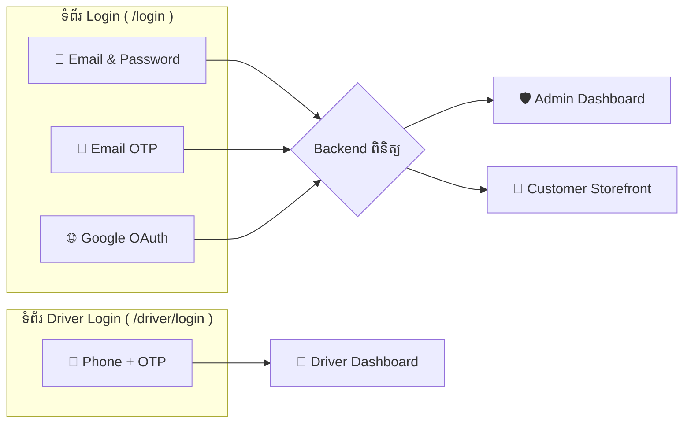
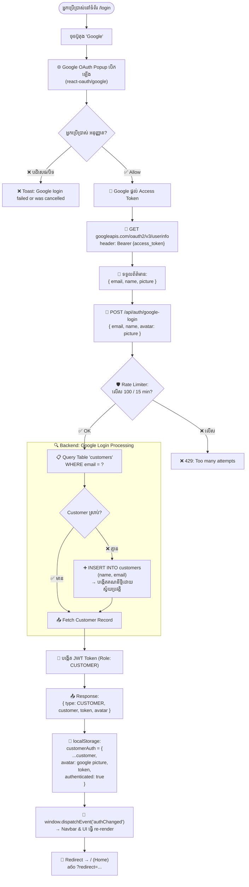
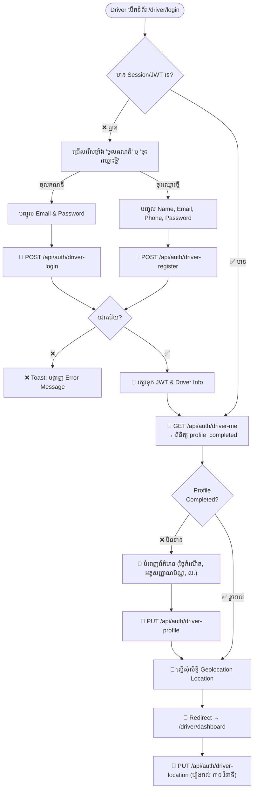
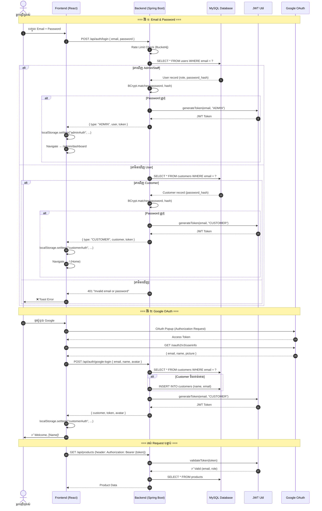
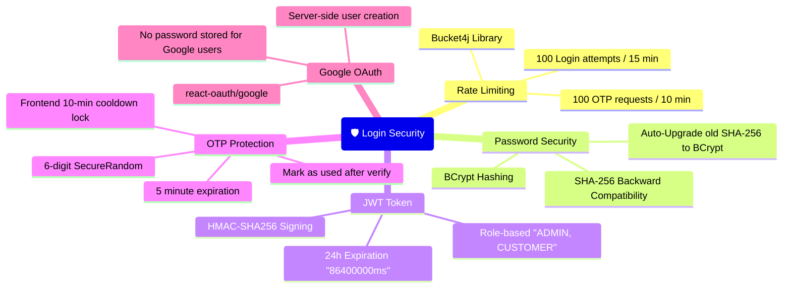

# 🔐 Flame & Crust — Login / Authentication Flowcharts

ឯកសារនេះរៀបរាប់អំពីដំណើរការ Login ទាំងអស់នៅក្នុង Project រួមទាំង **Backend API Endpoints**, **Frontend UI Flow**, និង **ដ្យាក្រាមលម្អិត (Flowcharts)** នៃរបៀបដែលប្រព័ន្ធផ្ទៀងផ្ទាត់អត្តសញ្ញាណដំណើរការ។

---

## 📑 តារាងមាតិកា (Table of Contents)
1. [ប្រព័ន្ធ Login សរុប (System Overview)](#1-ប្រព័ន្ធ-login-សរុប)
2. [វិធីសាស្ត្រ Login ទាំង ៤ (All Login Methods)](#2-វិធីសាស្ត្រ-login-ទាំង-៤)
3. [Flowchart #1 — Unified Login Flow (Email & Password)](#3-flowchart-1--unified-login-flow)
4. [Flowchart #2 — OTP Login Flow (Email OTP)](#4-flowchart-2--otp-login-flow)
5. [Flowchart #3 — Google OAuth Login Flow](#5-flowchart-3--google-oauth-login-flow)
6. [Flowchart #4 — Driver Login Flow (Phone + OTP)](#6-flowchart-4--driver-login-flow)
7. [Sequence Diagram — Full Authentication Lifecycle](#7-sequence-diagram--full-authentication-lifecycle)
8. [API Endpoints Summary](#8-api-endpoints-summary)
9. [Security Mechanisms](#9-security-mechanisms)

---

## 1. ប្រព័ន្ធ Login សរុប

គម្រោង Flame & Crust ប្រើប្រាស់ **ប្រព័ន្ធ Login រួម (Unified Login System)** ដែលអ្នកប្រើប្រាស់គ្រប់ប្រភេទ (**Admin**, **Staff**, **Customer**, **Driver**) អាចចូលប្រើប្រាស់ប្រព័ន្ធតាមរយៈទំព័រ Login តែមួយ។

---

## 2. វិធីសាស្ត្រ Login ទាំង ៤

| ល.រ | វិធីសាស្ត្រ (Method) | សម្រាប់អ្នកប្រើប្រាស់ (For Users) | Backend Endpoint | Frontend Route |
| :---: | :--- | :--- | :--- | :--- |
| **1** | Email & Password | Admin, Staff, Manager, Customer | `POST /api/auth/login` | `/login` (Tab: Email & Password) |
| **2** | Email OTP (One-Time Code) | Customer (គ្មាន Password) | `POST /api/auth/send-otp` → `POST /api/auth/verify-otp` | `/login` (Tab: Email OTP) |
| **3** | Google OAuth 2.0 | Customer | `POST /api/auth/google-login` | `/login` (Button: Google) |
| **4** | Phone + OTP | Driver ប៉ុណ្ណោះ | `POST /api/admin/otps` (create) | `/driver/login` |

---

## 3. Flowchart #1 — Unified Login Flow

### ដំណើរការ Login តាម Email & Password (Admin / Customer)

នេះជាវិធីសាស្ត្រចម្បងដែលប្រើបានទាំង Admin, Staff និង Customer។ Backend ពិនិត្យក្នុង **Table `users` (Staff/Admin)** ជាមុន រួចប្រសិនបើរកមិនឃើញ វានឹងពិនិត្យបន្តក្នុង **Table `customers`**។

```mermaid
flowchart TD
    Start([អ្នកប្រើប្រាស់បើកទំព័រ /login]) --> SelectTab["ជ្រើសរើសផ្ទាំង 'Email & Password'"]
    SelectTab --> InputForm["បញ្ចូល Email & Password"]
    InputForm --> ClickSignIn{ចុច 'Sign In'}

    ClickSignIn --> FrontendValidate{"Frontend ពិនិត្យ:\n• Email មិនទទេ?\n• Password មិនទទេ?"}
    FrontendValidate -- ❌ ទទេ --> ShowError1["❌ Toast: Please enter both email and password"]
    FrontendValidate -- ✅ OK --> SendToBackend["📡 POST /api/auth/login\n{ email, password }"]

    SendToBackend --> RateLimit{"🛡️ Rate Limiter:\nលើស 100 request / 15 min?"}
    RateLimit -- ❌ លើស --> Return429["❌ 429: Too many attempts"]
    RateLimit -- ✅ OK --> CheckUsersTable

    subgraph "🔍 Backend: ពិនិត្យអត្តសញ្ញាណ"
        CheckUsersTable["📋 Query Table 'users'\nWHERE email = ? AND status = 'ACTIVE'\nJOIN roles ON role_id"]
        CheckUsersTable --> UserFound{រកឃើញ User?}

        UserFound -- ✅ ឃើញ --> VerifyAdminPw{"🔐 ផ្ទៀងផ្ទាត់ Password:\n1. BCrypt.matches()\n2. Fallback: SHA-256"}
        VerifyAdminPw -- ✅ ត្រូវ --> IsAdmin["✅ Login ជោគជ័យ (Admin/Staff)"]
        VerifyAdminPw -- ❌ ខុស --> CheckCustomersTable

        UserFound -- ❌ មិនឃើញ --> CheckCustomersTable["📋 Query Table 'customers'\nWHERE email = ? AND status = 'ACTIVE'"]
        CheckCustomersTable --> CustomerFound{រកឃើញ Customer?}

        CustomerFound -- ✅ ឃើញ --> VerifyCustomerPw{"🔐 ផ្ទៀងផ្ទាត់ Password:\n1. BCrypt.matches()\n2. Fallback: SHA-256"}
        CustomerFound -- ✅ ឃើញ --> VerifyCustomerPw{"🔐 ផ្ទៀងផ្ទាត់ Password:\n1. BCrypt.matches()\n2. Fallback: SHA-256"}
        VerifyCustomerPw -- ✅ ត្រូវ --> IsCustomer["✅ Login ជោគជ័យ (Customer)"]
        VerifyCustomerPw -- ❌ ខុស --> CheckDriversTable

        CustomerFound -- ❌ មិនឃើញ --> CheckDriversTable["📋 Query Table 'drivers'\nWHERE email = ? AND status != 'SUSPENDED'"]
        CheckDriversTable --> DriverFound{រកឃើញ Driver?}
        
        DriverFound -- ✅ ឃើញ --> VerifyDriverPw{"🔐 ផ្ទៀងផ្ទាត់ Password"}
        VerifyDriverPw -- ✅ ត្រូវ --> IsDriver["✅ Login ជោគជ័យ (Driver)"]
        VerifyDriverPw -- ❌ ខុស --> LoginFail["❌ 401: Invalid email or password"]
        
        DriverFound -- ❌ មិនឃើញ --> LoginFail
    end

    IsAdmin --> GenerateJWTAdmin["🎫 បង្កើត JWT Token\n(Role: ADMIN / MANAGER / STAFF)"]
    GenerateJWTAdmin --> ReturnAdmin["📤 Response:\n{ type: ADMIN, user, token }"]
    ReturnAdmin --> StoreAdminAuth["💾 localStorage:\n• adminAuth = { ...user, token }\n• customerAuth = { ...user, token }"]
    StoreAdminAuth --> RedirectAdmin["🔄 Redirect → /admin/dashboard"]

    IsCustomer --> GenerateJWTCustomer["🎫 បង្កើត JWT Token\n(Role: CUSTOMER)"]
    GenerateJWTCustomer --> ReturnCustomer["📤 Response:\n{ type: CUSTOMER, customer, token }"]
    ReturnCustomer --> StoreCustomerAuth["💾 localStorage:\n• customerAuth = { ...customer, token }\n• Remove adminAuth"]
    StoreCustomerAuth --> RedirectCustomer["🔄 Redirect → / (Home) ឬ ?redirect=..."]

    IsDriver --> GenerateJWTDriver["🎫 បង្កើត JWT Token\n(Role: DRIVER)"]
    GenerateJWTDriver --> ReturnDriver["📤 Response:\n{ type: DRIVER, driver, token }"]
    ReturnDriver --> StoreDriverAuth["💾 localStorage:\n• driverAuth = { ...driver, token }"]
    StoreDriverAuth --> RedirectDriver["🔄 Redirect → /driver/dashboard"]

    LoginFail --> ShowErrorMsg["❌ Toast: Invalid email or password"]
    Return429 --> ShowErrorMsg429["❌ Toast: Too many attempts"]
```

---

## 4. Flowchart #2 — OTP Login Flow

### ដំណើរការ Login តាម Email OTP (Customer ដែលមិនមាន Password)

```mermaid
flowchart TD
    Start([អ្នកប្រើប្រាស់បើកទំព័រ /login]) --> SelectOTP["ជ្រើសរើសផ្ទាំង 'Email OTP'"]
    SelectOTP --> InputEmail["បញ្ចូល Email Address"]
    InputEmail --> ClickSend{ចុច 'Send One-Time Code'}

    ClickSend --> ValidateEmail{"Frontend ពិនិត្យ:\n• Email format ត្រឹមត្រូវ?\n• មាន '@' ?\n• យ៉ាងតិច ៥ អក្សរ?"}
    ValidateEmail -- ❌ ខុស --> ShowError1["❌ Toast: Please enter a valid email"]
    ValidateEmail -- ✅ OK --> CheckLock{"⏱️ OTP Rate Lock:\nផុតកំណត់ហើយ?"}

    CheckLock -- ❌ កំពុង Lock --> ShowLockMsg["❌ Toast: Please wait X minutes"]
    CheckLock -- ✅ OK --> SendOTP["📡 POST /api/auth/send-otp\n{ email }"]

    SendOTP --> BackendRateLimit{"🛡️ Rate Limiter:\nលើស 100 OTP / 10 min?"}
    BackendRateLimit -- ❌ លើស --> Return429OTP["❌ 429: Too many OTP requests"]
    BackendRateLimit -- ✅ OK --> GenerateOTP

    subgraph "🔑 Backend: បង្កើត OTP"
        GenerateOTP["🎲 SecureRandom: បង្កើតលេខ ៦ ខ្ទង់\nExpires: ៥ នាទីក្រោយ"]
        GenerateOTP --> SaveOTP["💾 INSERT INTO otps\n(target, otp_code, is_used, expires_at)"]
        SaveOTP --> SendEmail["📧 ផ្ញើ OTP Code ទៅ Email\n(EmailService.sendOtpEmail)"]
        SendEmail --> LogOTP["📝 Log OTP ក្នុង Console\n(សម្រាប់ Local Dev Testing)"]
    end

    LogOTP --> ReturnSuccess["📤 Response: { message: 'OTP generated successfully' }"]
    ReturnSuccess --> ShowOTPForm["🔢 ផ្លាស់ប្ដូរទំព័រ:\nបង្ហាញ Form បញ្ចូលកូដ OTP ៦ ខ្ទង់"]

    ShowOTPForm --> InputOTP["អ្នកប្រើប្រាស់បញ្ចូលកូដ OTP ៦ ខ្ទង់"]
    InputOTP --> ClickVerify{ចុច 'Verify & Sign In'}

    ClickVerify --> SendVerify["📡 POST /api/auth/verify-otp\n{ email, otp }"]

    SendVerify --> VerifyRateLimit{"🛡️ Rate Limiter:\nលើស 100 verify / 15 min?"}
    VerifyRateLimit -- ❌ លើស --> Return429Verify["❌ 429: Too many attempts"]
    VerifyRateLimit -- ✅ OK --> CheckOTP

    subgraph "🔍 Backend: ផ្ទៀងផ្ទាត់ OTP"
        CheckOTP["📋 Query Table 'otps'\nWHERE target = email\nAND otp_code = ?\nAND is_used = false\nAND expires_at > NOW()"]
        CheckOTP --> OTPValid{OTP ត្រឹមត្រូវ?}

        OTPValid -- ❌ ខុស/ផុតកំណត់ --> OTPFail["❌ 401: Invalid or expired OTP"]
        OTPValid -- ✅ ត្រូវ --> MarkUsed["📝 UPDATE otps SET is_used = true"]
        MarkUsed --> FindCustomer["📋 Query Table 'customers'\nWHERE email = ?"]
        FindCustomer --> CustomerExists{Customer មានរួចហើយ?}

        CustomerExists -- ❌ គ្មាន --> CreateCustomer["➕ INSERT INTO customers\n(name, email)\nname = email prefix"]
        CustomerExists -- ✅ មាន --> FetchCustomer["📤 Fetch Customer Data"]
        CreateCustomer --> FetchCustomer
    end

    FetchCustomer --> GenJWT["🎫 បង្កើត JWT Token (Role: CUSTOMER)"]
    GenJWT --> ReturnData["📤 Response: { customer, token }"]
    ReturnData --> StoreAuth["💾 localStorage:\ncustomerAuth = { ...customer, token }"]
    StoreAuth --> Redirect["🔄 Redirect → / (Home)"]

    OTPFail --> ShowOTPError["❌ Toast: Invalid or expired OTP"]
    Return429OTP --> ShowLock2["❌ Toast: Too many OTP requests\n⏱️ Lock 10 នាទី"]
```

---

## 5. Flowchart #3 — Google OAuth Login Flow

### ដំណើរការ Login តាម Google Account (Customer)

---

## 6. Flowchart #4 — Driver Login Flow

### ដំណើរការ Login សម្រាប់ Driver (Phone + OTP)

---

## 7. Sequence Diagram — Full Authentication Lifecycle

### ដំណើរការទាំងមូលពី Login រហូតដល់ Authenticated API Calls

---

## 8. API Endpoints Summary

### Authentication Endpoints (`/api/auth/...`)

| Method | Endpoint | Body | ការពិពណ៌នា | Response |
| :--- | :--- | :--- | :--- | :--- |
| `POST` | `/api/auth/login` | `{ email, password }` | **Unified Login** — ពិនិត្យទាំង `users` និង `customers` | `{ type, user/customer, token }` |
| `POST` | `/api/auth/admin-login` | `{ email, password }` | Admin Login — ពិនិត្យតែ `users` table | `{ user, token }` |
| `POST` | `/api/auth/customer-login` | `{ email, password }` | Customer Login — ពិនិត្យតែ `customers` table | `{ customer, token }` |
| `POST` | `/api/auth/send-otp` | `{ email }` | ផ្ញើ OTP ទៅ Email (មានកំណត់ 100 req/10min) | `{ message }` |
| `POST` | `/api/auth/verify-otp` | `{ email, otp }` | ផ្ទៀងផ្ទាត់ OTP ៦ ខ្ទង់ ហើយ Login | `{ customer, token }` |
| `POST` | `/api/auth/google-login` | `{ email, name, avatar }` | Google OAuth Login (Auto-create customer) | `{ customer, token, avatar }` |

---

## 9. Security Mechanisms

### ✅ មុខងារសុវត្ថិភាពដែលមានក្នុង Login System

| មុខងារ (Feature) | ការពិពណ៌នា (Description) |
| :--- | :--- |
| **Rate Limiting (Bucket4j)** | កំណត់ចំនួនការព្យាយាម Login/OTP ក្នុងរយៈពេលកំណត់ ដើម្បីការពារ Brute Force Attack |
| **BCrypt Password Hashing** | ពាក្យសម្ងាត់ត្រូវបាន Hash ដោយ BCrypt (salt + cost factor) មុនពេលរក្សាទុកក្នុង Database |
| **SHA-256 → BCrypt Auto-Upgrade** | ប្រសិនបើអ្នកប្រើប្រាស់មានពាក្យសម្ងាត់ Hash ចាស់ (SHA-256) ប្រព័ន្ធនឹង Upgrade វាដោយស្វ័យប្រវត្តិទៅ BCrypt ពេល Login ជោគជ័យ |
| **JWT Token (24h Expiry)** | Token មានសុពលភាពតែ ២៤ម៉ោង ហើយមាន Role (ADMIN/CUSTOMER) ផ្ទុកនៅខាងក្នុង |
| **OTP 6-Digit (SecureRandom)** | កូដ OTP ត្រូវបានបង្កើតដោយ `java.security.SecureRandom` មិនអាចទស្សន៍ទាយបាន |
| **OTP 5-Min Expiry** | កូដ OTP ផុតកំណត់ក្នុង ៥ នាទី ហើយអាចប្រើបានម្ដងប៉ុណ្ណោះ (is_used flag) |
| **Frontend Cooldown Lock** | ប្រសិនបើ OTP ត្រូវបាន Rate Limited (429) Frontend នឹង Lock ១០ នាទីមិនឱ្យស្នើសុំ OTP ម្ដងទៀត |
| **Auto-Create Customer (Google/OTP)** | ប្រសិនបើ Email មិនទាន់មានក្នុង Database ប្រព័ន្ធនឹងបង្កើតគណនី Customer ថ្មីដោយស្វ័យប្រវត្តិ |

---

*ឯកសារនេះសរសេរដោយផ្អែកលើ Source Code ជាក់ស្ដែងរបស់គម្រោង Flame & Crust Artisan Kitchen។*
